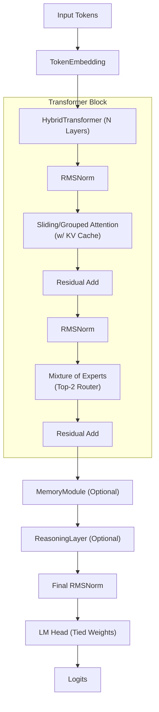

# FantasyData

## Description
A from-scratch Large Language Model (LLM) designed specifically for story generation. This project implements modern Transformer architectural improvements to generate creative fantasy narratives.

## Features
- **Grouped Query Attention (GQA)**: For efficient and scalable attention computation.
- **Rotary Position Embeddings (RoPE)**: For better relative position encoding.
- **SwiGLU Activation**: Used in the feed-forward networks for improved performance.
- **RMSNorm**: For more stable and efficient normalization.
- **Custom BPE Tokenizer**: A Byte-Pair Encoding tokenizer trained from scratch on fantasy text data.

## Project Structure
- `app/`: Application layer (CLI, story generator).
- `data/`: Datasets and tokenizer files.
- `experiments/`: Benchmarking, ablation studies, and component tests.
- `memory/`: Conversation and vector embedding stores for context.
- `model/`: Neural network architecture components.
- `rag/`: Retrieval-Augmented Generation implementation for context retrieval.
- `tokenizer/`: BPE tokenizer implementation and tools.
- `training/`: Training loops and checkpointing.

## Quick Start
1. **Install Dependencies**: `pip install -r requirements.txt`
2. **Download Data**: Place your text data in `data/`
3. **Train Tokenizer**: `python tokenizer/trainer.py`
4. **Preprocess Data**: Use data preprocessing scripts.
5. **Train**: `python training/train.py`
6. **Generate**: `python generate.py --checkpoint path/to/ckpt --prompt "Once upon a time"`

## Model Architecture Details

The model (`FantasyLLM`) uses a Transformer decoder architecture with 8000 vocabulary size, 128 context length, and 192 embedding dimension. It is enhanced with Mixture of Experts (MoE), Memory-Augmented Attention, and Iterative Reasoning capabilities.

## Training Details
Standard auto-regressive language modeling objective (cross-entropy loss).

## Generation Usage
Use `python chat.py --checkpoint ckpt.pt` for an interactive chat, or `generate.py` for one-shot text generation.

## License
MIT License
