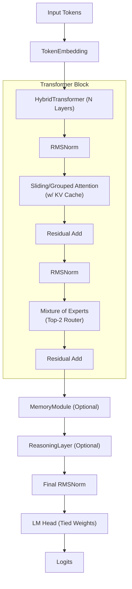

# FantasyData

## Description
A from-scratch Large Language Model (LLM) designed specifically for story generation. This project implements modern Transformer architectural improvements to generate creative fantasy narratives.

## Features
- **Grouped Query Attention (GQA)**: For efficient and scalable attention computation.
- **Rotary Position Embeddings (RoPE)**: For better relative position encoding.
- **SwiGLU Activation**: Used in the feed-forward networks for improved performance.
- **RMSNorm**: For more stable and efficient normalization.
- **Custom BPE Tokenizer**: A Byte-Pair Encoding tokenizer trained from scratch on fantasy text data.

## Project Structure
- `app/`: Application layer (CLI, story generator).
- `data/`: Datasets and tokenizer files.
- `experiments/`: Benchmarking, ablation studies, and component tests.
- `memory/`: Conversation and vector embedding stores for context.
- `model/`: Neural network architecture components.
- `rag/`: Retrieval-Augmented Generation implementation for context retrieval.
- `tokenizer/`: BPE tokenizer implementation and tools.
- `training/`: Training loops and checkpointing.

## Quick Start
1. **Install Dependencies**: `pip install -r requirements.txt`
2. **Download Data**: Place your text data in `data/`
3. **Train Tokenizer**: `python tokenizer/trainer.py`
4. **Preprocess Data**: Use data preprocessing scripts.
5. **Train**: `python training/train.py`
6. **Generate**: `python generate.py --checkpoint path/to/ckpt --prompt "Once upon a time"`

## Model Architecture Details

The model (`FantasyLLM`) uses a Transformer decoder architecture with 8000 vocabulary size, 128 context length, and 192 embedding dimension. It is enhanced with Mixture of Experts (MoE), Memory-Augmented Attention, and Iterative Reasoning capabilities.

## Training Details
Standard auto-regressive language modeling objective (cross-entropy loss).

## Generation Usage
Use `python chat.py --checkpoint ckpt.pt` for an interactive chat, or `generate.py` for one-shot text generation.

## License

MIT License

Copyright (c) 2026 Tamizharuvi

Permission is hereby granted, free of charge, to any person obtaining a copy
of this software and associated documentation files (the "Software"), to deal
in the Software without restriction, including without limitation the rights
to use, copy, modify, merge, publish, distribute, sublicense, and/or sell
copies of the Software, and to permit persons to whom the Software is
furnished to do so, subject to the following conditions:

The above copyright notice and this permission notice shall be included in all
copies or substantial portions of the Software.

THE SOFTWARE IS PROVIDED "AS IS", WITHOUT WARRANTY OF ANY KIND, EXPRESS OR
IMPLIED, INCLUDING BUT NOT LIMITED TO THE WARRANTIES OF MERCHANTABILITY,
FITNESS FOR A PARTICULAR PURPOSE AND NONINFRINGEMENT. IN NO EVENT SHALL THE
AUTHORS OR COPYRIGHT HOLDERS BE LIABLE FOR ANY CLAIM, DAMAGES OR OTHER
LIABILITY, WHETHER IN AN ACTION OF CONTRACT, TORT OR OTHERWISE, ARISING FROM,
OUT OF OR IN CONNECTION WITH THE SOFTWARE OR THE USE OR OTHER DEALINGS IN THE
SOFTWARE.
