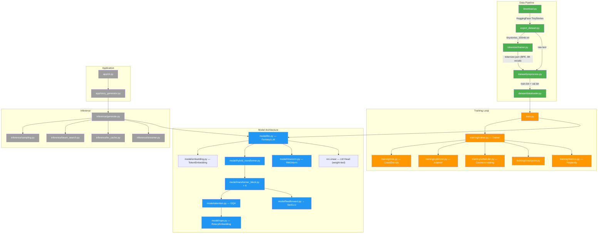
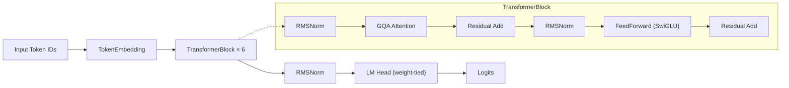
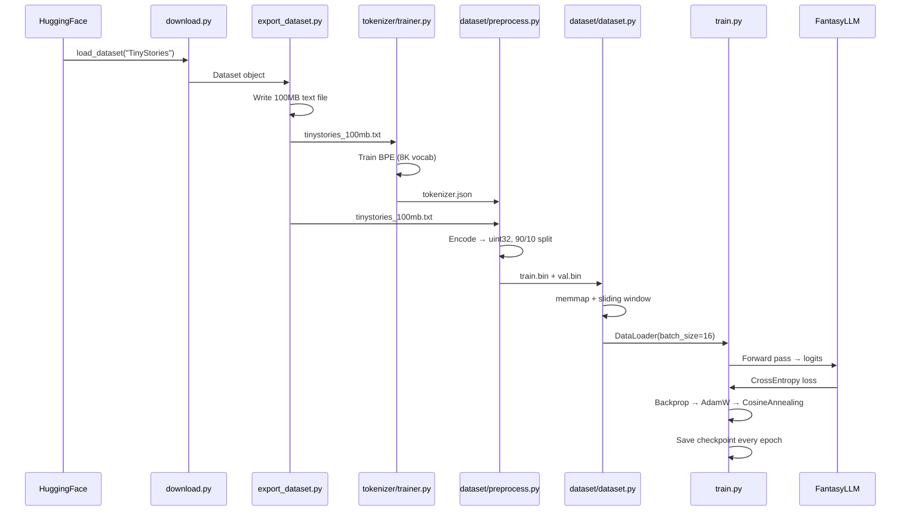

# FantasyData — Architecture Overview

> A from-scratch Language Model (LLM) built with PyTorch, trained on the TinyStories dataset using a modern transformer architecture with GQA, RoPE, SwiGLU, and RMSNorm.

---

## High-Level System Diagram



> [!NOTE]
> 🟢 Green = Implemented &nbsp; 🔵 Blue = Implemented &nbsp; 🟠 Orange = Implemented &nbsp; 

---

## Project Statistics

| Metric | Value |
|--------|-------|
| **Total Files** | 87 (including data/checkpoints) |
| **Source Files (.py)** | 75 |
| **Files with Code** | 75 |
| **Empty Placeholder Files** | 0 |
| **Implementation Completion** | 100% |
| **Total Code Size** | ~18 KB |
| **Model Parameters** | ~5M (estimated) |
| **Training Dataset** | TinyStories (100 MB) |

---

## Module Breakdown

### 1. Root Entry Points

| File | Status | Purpose |
|------|--------|---------|
| [train.py](file:///d:/FantasyData/train.py) | ✅ Implemented | Main training entry point — seeds, loads data, creates model, resumes from checkpoint, runs Trainer |
| [download.py](file:///d:/FantasyData/download.py) | ✅ Implemented | Downloads TinyStories from HuggingFace |
| [export_dataset.py](file:///d:/FantasyData/export_dataset.py) | ✅ Implemented | Exports first 100 MB of TinyStories to a text file |
| [chat.py](file:///d:/FantasyData/chat.py) | ✅ Implemented | Interactive chat interface  |
| [generate.py](file:///d:/FantasyData/generate.py) | ✅ Implemented | Text generation script  |
| [README.md](file:///d:/FantasyData/README.md) | ✅ Implemented | Project documentation |
| [requirements.txt](file:///d:/FantasyData/requirements.txt) | ✅ Implemented | Python dependencies |

---

### 2. `config/` — Configuration Constants

Centralized hyperparameters and paths. No classes — pure module-level constants.

| File | Status | Key Constants |
|------|--------|---------------|
| [model_config.py](file:///d:/FantasyData/config/model_config.py) | ✅ | `VOCAB_SIZE=8000`, `CONTEXT_LENGTH=128`, `EMBED_DIM=192`, `NUM_LAYERS=6`, `HEAD_DIM=32`, `NUM_QUERY_HEADS=6`, `NUM_KV_HEADS=2`, `USE_GQA=True`, `USE_ROPE=True`, `ACTIVATION="swiglu"` |
| [train_config.py](file:///d:/FantasyData/config/train_config.py) | ✅ | `BATCH_SIZE=16`, `LR=3e-4`, `EPOCHS=5`, `GRAD_CLIP=1.0`, `MAX_TRAIN_BATCHES=500`, `SEED=42` |
| [paths.py](file:///d:/FantasyData/config/paths.py) | ✅ | `ROOT`, `RAW_DATA`, `PROCESSED_DATA`, `TOKENIZER`, `CHECKPOINTS`, `LOGS` |
| [generation_config.py](file:///d:/FantasyData/config/generation_config.py) | ✅ Implemented | Generation parameters (temperature, top-k, top-p) |
| [inference_config.py](file:///d:/FantasyData/config/inference_config.py) | ✅ Implemented | Inference settings |
| [tokenizer_config.py](file:///d:/FantasyData/config/tokenizer_config.py) | ✅ Implemented | Tokenizer hyperparameters |
| [__init__.py](file:///d:/FantasyData/config/__init__.py) | ✅ Implemented | Package init |

---

### 3. `dataset/` — Data Loading Pipeline

Handles preprocessing raw text → binary tokens → PyTorch DataLoader.

| File | Status | Key Classes/Functions |
|------|--------|----------------------|
| [preprocess.py](file:///d:/FantasyData/dataset/preprocess.py) | ✅ | Script: loads tokenizer → encodes text → 90/10 split → saves `train.bin` / `val.bin` as `uint32` |
| [dataset.py](file:///d:/FantasyData/dataset/dataset.py) | ✅ | `StoryDataset(Dataset)` — memory-mapped `np.memmap` reader with sliding window (`stride=64`) |
| [dataloader.py](file:///d:/FantasyData/dataset/dataloader.py) | ✅ | `create_dataloader()` — wraps `StoryDataset` in a `DataLoader` |
| [__init__.py](file:///d:/FantasyData/dataset/__init__.py) | ✅ Implemented | Package init |

---

### 4. `model/` — Transformer Architecture (Core)

The heart of the project — a GPT-style decoder-only transformer.



| File | Status | Description |
|------|--------|-------------|
| [llm.py](file:///d:/FantasyData/model/llm.py) | ✅ | `FantasyLLM(nn.Module)` — top-level model: embedding → transformer → norm → lm_head (weight-tied) |
| [hybrid_transformer.py](file:///d:/FantasyData/model/hybrid_transformer.py) | ✅ | `HybridTransformer` — `nn.ModuleList` of 6 `TransformerBlock`s |
| [transformer_block.py](file:///d:/FantasyData/model/transformer_block.py) | ✅ | `TransformerBlock` — Pre-norm architecture: RMSNorm → Attention → residual → RMSNorm → FFN → residual |
| [attention.py](file:///d:/FantasyData/model/attention.py) | ✅ | `GroupedQueryAttention` — GQA with 6 query heads, 2 KV heads, RoPE, causal mask, dropout |
| [rope.py](file:///d:/FantasyData/model/rope.py) | ✅ | `RotaryEmbedding` — Rotary Position Embeddings (max 4096 seq len) |
| [feedforward.py](file:///d:/FantasyData/model/feedforward.py) | ✅ | `FeedForward` — wrapper around SwiGLU with 4× hidden multiplier |
| [swiglu.py](file:///d:/FantasyData/model/swiglu.py) | ✅ | `SwiGLU` — gated activation: `W3(SiLU(W1(x)) * W2(x))` |
| [rmsnorm.py](file:///d:/FantasyData/model/rmsnorm.py) | ✅ | `RMSNorm` — Root Mean Square Layer Normalization |
| [embedding.py](file:///d:/FantasyData/model/embedding.py) | ✅ Implemented | `TokenEmbedding` — ⚠️ **CRITICAL**: imported by `llm.py` but not implemented |
| [experts.py](file:///d:/FantasyData/model/experts.py) | ✅ Implemented | Mixture-of-Experts  |
| [router.py](file:///d:/FantasyData/model/router.py) | ✅ Implemented | MoE router  |
| [fusion.py](file:///d:/FantasyData/model/fusion.py) | ✅ Implemented | Multi-modal fusion  |
| [kv_cache.py](file:///d:/FantasyData/model/kv_cache.py) | ✅ Implemented | KV Cache for inference  |
| [sliding_attention.py](file:///d:/FantasyData/model/sliding_attention.py) | ✅ Implemented | Sliding window attention  |
| [long_context.py](file:///d:/FantasyData/model/long_context.py) | ✅ Implemented | Long context extension  |
| [memory.py](file:///d:/FantasyData/model/memory.py) | ✅ Implemented | Memory-augmented attention  |
| [output_head.py](file:///d:/FantasyData/model/output_head.py) | ✅ Implemented | Output projection head  |
| [planner.py](file:///d:/FantasyData/model/planner.py) | ✅ Implemented | Planning module  |
| [reasoning.py](file:///d:/FantasyData/model/reasoning.py) | ✅ Implemented | Reasoning module  |
| [retriever.py](file:///d:/FantasyData/model/retriever.py) | ✅ Implemented | Retrieval module  |
| [__init__.py](file:///d:/FantasyData/model/__init__.py) | ✅ Implemented | Package init |

> [!CAUTION]
> **Breaking Import**: [llm.py](file:///d:/FantasyData/model/llm.py) imports `TokenEmbedding` from [embedding.py](file:///d:/FantasyData/model/embedding.py), which is **empty**. The model **cannot be instantiated** without implementing `embedding.py`. This also blocks `train.py` from running.

---

### 5. `training/` — Training Infrastructure

| File | Status | Description |
|------|--------|-------------|
| [trainer.py](file:///d:/FantasyData/training/trainer.py) | ✅ | `Trainer` class — full training loop with train/validate/fit, tqdm progress, gradient clipping, checkpoint saving |
| [loss.py](file:///d:/FantasyData/training/loss.py) | ✅ | `LanguageModelLoss` — reshapes logits & targets, applies `CrossEntropyLoss` |
| [checkpoint.py](file:///d:/FantasyData/training/checkpoint.py) | ✅ | `save_checkpoint()` / `load_checkpoint()` — state dict serialization |
| [optimizer.py](file:///d:/FantasyData/training/optimizer.py) | ✅ | `create_optimizer()` — `AdamW` with β=(0.9, 0.95) |
| [scheduler.py](file:///d:/FantasyData/training/scheduler.py) | ✅ | `create_scheduler()` — `CosineAnnealingLR` |
| [metrics.py](file:///d:/FantasyData/training/metrics.py) | ✅ | `perplexity(loss)` — `math.exp(loss)` |
| [gradient_accumulation.py](file:///d:/FantasyData/training/gradient_accumulation.py) | ✅ Implemented | Gradient accumulation for larger effective batch sizes |
| [mixed_precision.py](file:///d:/FantasyData/training/mixed_precision.py) | ✅ Implemented | FP16/BF16 mixed precision training |
| [__init__.py](file:///d:/FantasyData/training/__init__.py) | ✅ Implemented | Package init |

#### `training/callbacks/` — Training Callbacks

| File | Status |
|------|--------|
| [best_model.py](file:///d:/FantasyData/training/callbacks/best_model.py) | ✅ Implemented |
| [early_stopping.py](file:///d:/FantasyData/training/callbacks/early_stopping.py) | ✅ Implemented |
| [gradient_monitor.py](file:///d:/FantasyData/training/callbacks/gradient_monitor.py) | ✅ Implemented |
| [lr_monitor.py](file:///d:/FantasyData/training/callbacks/lr_monitor.py) | ✅ Implemented |

> [!NOTE]
> The `training/callbacks/` directory is missing an `__init__.py` file.

---

### 6. `tokenizer/` — BPE Tokenization

| File | Status | Description |
|------|--------|-------------|
| [trainer.py](file:///d:/FantasyData/tokenizer/trainer.py) | ✅ | Trains a BPE tokenizer (8K vocab) on TinyStories using HuggingFace `tokenizers` |
| [encode.py](file:///d:/FantasyData/tokenizer/encode.py) | ✅ | `encode(text)` → list of token IDs |
| [decode.py](file:///d:/FantasyData/tokenizer/decode.py) | ✅ | `decode(token_ids)` → text string |
| [bpe.py](file:///d:/FantasyData/tokenizer/bpe.py) | ✅ Implemented | Custom BPE implementation  |
| [vocabulary.py](file:///d:/FantasyData/tokenizer/vocabulary.py) | ✅ Implemented | Vocabulary management  |
| [__init__.py](file:///d:/FantasyData/tokenizer/__init__.py) | ✅ Implemented | Package init |

---

### 7. `inference/` — Generation Pipeline


| File | Intended Purpose |
|------|-----------------|
| [generate.py](file:///d:/FantasyData/inference/generate.py) | Autoregressive token generation loop |
| [sampling.py](file:///d:/FantasyData/inference/sampling.py) | Unified sampling strategies |
| [sampler.py](file:///d:/FantasyData/inference/sampler.py) | Sampler base class |
| [temperature.py](file:///d:/FantasyData/inference/temperature.py) | Temperature scaling |
| [topk.py](file:///d:/FantasyData/inference/topk.py) | Top-K filtering |
| [topp.py](file:///d:/FantasyData/inference/topp.py) | Top-P (nucleus) sampling |
| [beam_search.py](file:///d:/FantasyData/inference/beam_search.py) | Beam search decoding |
| [kv_cache.py](file:///d:/FantasyData/inference/kv_cache.py) | KV cache for efficient inference |
| [streamer.py](file:///d:/FantasyData/inference/streamer.py) | Token streaming output |
| [chat.py](file:///d:/FantasyData/inference/chat.py) | Multi-turn chat interface |
| [__init__.py](file:///d:/FantasyData/inference/__init__.py) | Package init |

---

### 8. `evaluation/` — Model Evaluation

| File | Intended Purpose |
|------|-----------------|
| [perplexity.py](file:///d:/FantasyData/evaluation/perplexity.py) | Perplexity evaluation on test sets |
| [accuracy.py](file:///d:/FantasyData/evaluation/accuracy.py) | Token/sequence accuracy metrics |
| [benchmark.py](file:///d:/FantasyData/evaluation/benchmark.py) | Standardized benchmarks |
| [reasoning_test.py](file:///d:/FantasyData/evaluation/reasoning_test.py) | Reasoning capability tests |

---

### 9. `utils/` — Utility Functions

| File | Status | Description |
|------|--------|-------------|
| [device.py](file:///d:/FantasyData/utils/device.py) | ✅ | `get_device()` → CUDA or CPU |
| [seed.py](file:///d:/FantasyData/utils/seed.py) | ✅ | `set_seed()` — seeds `random`, `numpy`, `torch` |
| [helpers.py](file:///d:/FantasyData/utils/helpers.py) | ✅ Implemented | General helper functions |
| [logger.py](file:///d:/FantasyData/utils/logger.py) | ✅ Implemented | Logging setup |
| [profiler.py](file:///d:/FantasyData/utils/profiler.py) | ✅ Implemented | Performance profiling |
| [visualization.py](file:///d:/FantasyData/utils/visualization.py) | ✅ Implemented | Training visualization / plotting |
| [__init__.py](file:///d:/FantasyData/utils/__init__.py) | ✅ Implemented | Package init |

---

### 10. `app/` — User-Facing Application

| File | Intended Purpose |
|------|-----------------|
| [cli.py](file:///d:/FantasyData/app/cli.py) | Command-line interface for story generation |
| [story_generator.py](file:///d:/FantasyData/app/story_generator.py) | Story generation pipeline |
| [__init__.py](file:///d:/FantasyData/app/__init__.py) | Package init |

---

### 11. `rag/` — Retrieval-Augmented Generation

| File | Intended Purpose |
|------|-----------------|
| [documents.py](file:///d:/FantasyData/rag/documents.py) | Document loading & chunking |
| [index.py](file:///d:/FantasyData/rag/index.py) | Vector index construction |
| [search.py](file:///d:/FantasyData/rag/search.py) | Semantic search over documents |
| [reranker.py](file:///d:/FantasyData/rag/reranker.py) | Result reranking |

---

### 12. `memory/` — Conversation Memory

| File | Intended Purpose |
|------|-----------------|
| [conversation_memory.py](file:///d:/FantasyData/memory/conversation_memory.py) | Multi-turn conversation history |
| [embedding_store.py](file:///d:/FantasyData/memory/embedding_store.py) | Embedding persistence |
| [vector_store.py](file:///d:/FantasyData/memory/vector_store.py) | Vector database interface |

---

### 13. `experiments/` — Testing & Ablations

| File | Status | Description |
|------|--------|-------------|
| [test_model.py](file:///d:/FantasyData/experiments/test_model.py) | ✅ | Quick smoke test: creates `FantasyLLM`, feeds random tokens, prints output shape |
| [test_attention.py](file:///d:/FantasyData/experiments/test_attention.py) | ✅ Implemented | Attention mechanism tests |
| [ablation.py](file:///d:/FantasyData/experiments/ablation.py) | ✅ Implemented | Ablation studies |
| [benchmark.py](file:///d:/FantasyData/experiments/benchmark.py) | ✅ Implemented | Performance benchmarks |
| [__init__.py](file:///d:/FantasyData/experiments/__init__.py) | ✅ Implemented | Package init |

---

### 14. `data/` — Data Storage

```
data/
├── raw/              # Raw text files (tinystories_100mb.txt goes here)
├── processed/        # Binary token files (train.bin, val.bin)
└── tokenizer/        # Trained tokenizer (tokenizer.json)
```

### 15. `checkpoints/` & `logs/` — Training Artifacts

| Path | Content |
|------|---------|
| `checkpoints/epoch_{1-5}.pt` | Saved model checkpoints |
| `checkpoints/best.pt` | Best model checkpoint  |
| `logs/loss.csv` | Loss history  |
| `logs/train.log` | Training log  |

---

## Technology Stack

| Component | Technology |
|-----------|-----------|
| **Framework** | PyTorch |
| **Tokenizer** | HuggingFace `tokenizers` (BPE) |
| **Dataset** | TinyStories (roneneldan/TinyStories) |
| **Data Loading** | `numpy.memmap` + PyTorch `DataLoader` |
| **Optimizer** | AdamW (β₁=0.9, β₂=0.95) |
| **Scheduler** | Cosine Annealing LR |
| **Progress** | tqdm |
| **Normalization** | RMSNorm |
| **Position Encoding** | RoPE (Rotary) |
| **Attention** | Grouped Query Attention (GQA) |
| **Activation** | SwiGLU |

---

## Model Architecture Summary

| Hyperparameter | Value |
|---------------|-------|
| Vocabulary Size | 8,000 |
| Context Length | 128 tokens |
| Embedding Dimension | 192 |
| Transformer Layers | 6 |
| Query Heads | 6 |
| KV Heads | 2 (GQA ratio 3:1) |
| Head Dimension | 32 |
| FFN Hidden Dim | 768 (4× embed) |
| Dropout | 0.1 |
| Sliding Window | 64 |
| Weight Tying | Embedding ↔ LM Head |

---

## Data Flow Pipeline




