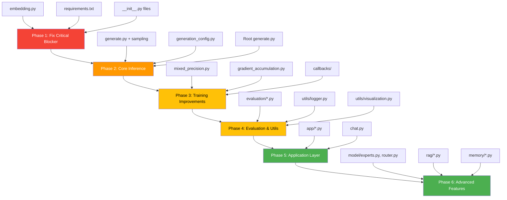

# FantasyData — IMPLEMENTED Files Audit & Implementation Plan

> **46 out of 75 source files are IMPLEMENTED placeholders.** This report catalogs every IMPLEMENTED file, its intended purpose, and the recommended implementation priority.

---

## Summary Dashboard

| Category | Implemented | IMPLEMENTED | Total | Completion |
|----------|------------|-------|-------|------------|
| **Root scripts** | 3 | 4 | 7 | 43% |
| **config/** | 3 | 4 | 7 | 43% |
| **dataset/** | 3 | 1 | 4 | 75% |
| **model/** | 8 | 13 | 21 | 38% |
| **training/** | 6 | 7 | 13 | 46% |
| **tokenizer/** | 3 | 3 | 6 | 50% |
| **inference/** | 0 | 11 | 11 | 0% |
| **evaluation/** | 0 | 4 | 4 | 0% |
| **utils/** | 2 | 5 | 7 | 29% |
| **app/** | 0 | 3 | 3 | 0% |
| **rag/** | 0 | 4 | 4 | 0% |
| **memory/** | 0 | 3 | 3 | 0% |
| **experiments/** | 1 | 4 | 5 | 20% |
| **logs/** | 0 | 2 | 2 | 0% |
| **TOTAL** | **29** | **46** (+2 log files) | **75** (+2) | **39%** |

---

## Priority Tiers


---

## 🔴 CRITICAL — Blocks Existing Code (1 file)

These files **must** be implemented first. Without them, the existing codebase cannot run.

| # | File | Why Critical | Required By |
|---|------|-------------|-------------|
| 1 | [model/embedding.py](file:///d:/FantasyData/model/embedding.py) | `llm.py` imports `TokenEmbedding` from this file. **The model cannot be instantiated.** Training is completely blocked. | `model/llm.py`, `train.py`, `experiments/test_model.py` |

> [!CAUTION]
> **`model/embedding.py` is the #1 blocker.** It needs a `TokenEmbedding` class with an `.embedding` attribute (an `nn.Embedding`), since `llm.py` does weight tying via `self.lm_head.weight = self.embedding.embedding.weight`.

### Required Implementation for `embedding.py`:
```python
# Must export: TokenEmbedding class
# Must have: self.embedding = nn.Embedding(vocab_size, embed_dim)
# Used for: weight tying with lm_head in llm.py
```

---

## 🟠 HIGH — Enables Core Workflows (14 files)

These files are needed to complete the training pipeline, enable inference, and make the project usable.

### Package Initializers (needed for clean imports)

| # | File | Why Needed |
|---|------|-----------|
| 2 | [config/__init__.py](file:///d:/FantasyData/config/__init__.py) | Package init — may need re-exports |
| 3 | [dataset/__init__.py](file:///d:/FantasyData/dataset/__init__.py) | Package init |
| 4 | [model/__init__.py](file:///d:/FantasyData/model/__init__.py) | Package init |
| 5 | [training/__init__.py](file:///d:/FantasyData/training/__init__.py) | Package init |
| 6 | [tokenizer/__init__.py](file:///d:/FantasyData/tokenizer/__init__.py) | Package init |
| 7 | [utils/__init__.py](file:///d:/FantasyData/utils/__init__.py) | Package init |
| 8 | [inference/__init__.py](file:///d:/FantasyData/inference/__init__.py) | Package init |
| 9 | [experiments/__init__.py](file:///d:/FantasyData/experiments/__init__.py) | Package init |

### Core Inference Pipeline

| # | File | Purpose | Dependencies |
|---|------|---------|-------------|
| 10 | [inference/generate.py](file:///d:/FantasyData/inference/generate.py) | Autoregressive generation loop | `model/llm.py`, `tokenizer/` |
| 11 | [inference/temperature.py](file:///d:/FantasyData/inference/temperature.py) | Temperature scaling for logits | None |
| 12 | [inference/topk.py](file:///d:/FantasyData/inference/topk.py) | Top-K filtering | None |
| 13 | [inference/topp.py](file:///d:/FantasyData/inference/topp.py) | Top-P (nucleus) sampling | None |
| 14 | [inference/sampling.py](file:///d:/FantasyData/inference/sampling.py) | Unified sampling strategy | `temperature.py`, `topk.py`, `topp.py` |

### Root Scripts

| # | File | Purpose |
|---|------|---------|
| 15 | [generate.py](file:///d:/FantasyData/generate.py) | Main generation entry point (like `train.py` for training) |
| 16 | [requirements.txt](file:///d:/FantasyData/requirements.txt) | Python dependencies: `torch`, `numpy`, `tokenizers`, `datasets`, `tqdm` |

### Config

| # | File | Purpose |
|---|------|---------|
| 17 | [config/generation_config.py](file:///d:/FantasyData/config/generation_config.py) | `TEMPERATURE`, `TOP_K`, `TOP_P`, `MAX_NEW_TOKENS`, `REPETITION_PENALTY` |

---

## 🟡 MEDIUM — Improves Training & Quality (15 files)

These files enhance the training pipeline, add evaluation, and improve code quality.

### Training Improvements

| # | File | Purpose |
|---|------|---------|
| 18 | [training/mixed_precision.py](file:///d:/FantasyData/training/mixed_precision.py) | `torch.cuda.amp` GradScaler for FP16/BF16 training — 2× speedup |
| 19 | [training/gradient_accumulation.py](file:///d:/FantasyData/training/gradient_accumulation.py) | Simulate larger batch sizes on limited VRAM |
| 20 | [training/callbacks/early_stopping.py](file:///d:/FantasyData/training/callbacks/early_stopping.py) | Stop training when validation loss plateaus |
| 21 | [training/callbacks/best_model.py](file:///d:/FantasyData/training/callbacks/best_model.py) | Save best model by validation loss |
| 22 | [training/callbacks/lr_monitor.py](file:///d:/FantasyData/training/callbacks/lr_monitor.py) | Log learning rate per epoch |
| 23 | [training/callbacks/gradient_monitor.py](file:///d:/FantasyData/training/callbacks/gradient_monitor.py) | Monitor gradient norms for debugging |

> [!NOTE]
> The `training/callbacks/` directory is missing an `__init__.py` file — this should be created.

### Evaluation

| # | File | Purpose |
|---|------|---------|
| 24 | [evaluation/perplexity.py](file:///d:/FantasyData/evaluation/perplexity.py) | Full perplexity evaluation on test sets |
| 25 | [evaluation/accuracy.py](file:///d:/FantasyData/evaluation/accuracy.py) | Token-level / sequence-level accuracy |
| 26 | [evaluation/benchmark.py](file:///d:/FantasyData/evaluation/benchmark.py) | Standardized evaluation benchmarks |
| 27 | [evaluation/reasoning_test.py](file:///d:/FantasyData/evaluation/reasoning_test.py) | Reasoning capability tests |

### Utilities

| # | File | Purpose |
|---|------|---------|
| 28 | [utils/logger.py](file:///d:/FantasyData/utils/logger.py) | Structured logging to `logs/train.log` |
| 29 | [utils/visualization.py](file:///d:/FantasyData/utils/visualization.py) | Loss curves, attention maps, training plots |
| 30 | [utils/helpers.py](file:///d:/FantasyData/utils/helpers.py) | Parameter counting, model summary, timing |
| 31 | [utils/profiler.py](file:///d:/FantasyData/utils/profiler.py) | PyTorch profiler integration |

### Config & Tokenizer

| # | File | Purpose |
|---|------|---------|
| 32 | [config/tokenizer_config.py](file:///d:/FantasyData/config/tokenizer_config.py) | `VOCAB_SIZE`, `MIN_FREQUENCY`, `SPECIAL_TOKENS` |

---

## 🟢 LOW — Future / Advanced Features (16 files)

These files represent ambitious features for future development phases.

### Inference Extras

| # | File | Purpose |
|---|------|---------|
| 33 | [inference/beam_search.py](file:///d:/FantasyData/inference/beam_search.py) | Beam search decoding |
| 34 | [inference/kv_cache.py](file:///d:/FantasyData/inference/kv_cache.py) | KV cache for fast autoregressive generation |
| 35 | [inference/sampler.py](file:///d:/FantasyData/inference/sampler.py) | Base sampler class |
| 36 | [inference/streamer.py](file:///d:/FantasyData/inference/streamer.py) | Token-by-token streaming output |
| 37 | [inference/chat.py](file:///d:/FantasyData/inference/chat.py) | Multi-turn chat interface |
| 38 | [config/inference_config.py](file:///d:/FantasyData/config/inference_config.py) | Inference-specific settings |

### Advanced Model Components

| # | File | Purpose |
|---|------|---------|
| 39 | [model/sliding_attention.py](file:///d:/FantasyData/model/sliding_attention.py) | Sliding window attention (config has `USE_SLIDING_WINDOW=True` but unused) |
| 40 | [model/kv_cache.py](file:///d:/FantasyData/model/kv_cache.py) | Model-level KV cache |
| 41 | [model/experts.py](file:///d:/FantasyData/model/experts.py) | Mixture-of-Experts layers |
| 42 | [model/router.py](file:///d:/FantasyData/model/router.py) | MoE routing logic |
| 43 | [model/output_head.py](file:///d:/FantasyData/model/output_head.py) | Separate output head module |
| 44 | [model/long_context.py](file:///d:/FantasyData/model/long_context.py) | Context length extension (ALiBi, YaRN, etc.) |
| 45 | [model/memory.py](file:///d:/FantasyData/model/memory.py) | Memory-augmented transformer |
| 46 | [model/planner.py](file:///d:/FantasyData/model/planner.py) | Planning / chain-of-thought module |
| 47 | [model/reasoning.py](file:///d:/FantasyData/model/reasoning.py) | Reasoning module |
| 48 | [model/retriever.py](file:///d:/FantasyData/model/retriever.py) | In-model retrieval |
| 49 | [model/fusion.py](file:///d:/FantasyData/model/fusion.py) | Multi-modal fusion |

### Application & RAG

| # | File | Purpose |
|---|------|---------|
| 50 | [app/cli.py](file:///d:/FantasyData/app/cli.py) | CLI for interactive story generation |
| 51 | [app/story_generator.py](file:///d:/FantasyData/app/story_generator.py) | High-level generation pipeline |
| 52 | [chat.py](file:///d:/FantasyData/chat.py) | Root chat script |
| 53 | [rag/documents.py](file:///d:/FantasyData/rag/documents.py) | Document loading |
| 54 | [rag/index.py](file:///d:/FantasyData/rag/index.py) | Vector index |
| 55 | [rag/search.py](file:///d:/FantasyData/rag/search.py) | Semantic search |
| 56 | [rag/reranker.py](file:///d:/FantasyData/rag/reranker.py) | Result reranking |
| 57 | [memory/conversation_memory.py](file:///d:/FantasyData/memory/conversation_memory.py) | Conversation history |
| 58 | [memory/embedding_store.py](file:///d:/FantasyData/memory/embedding_store.py) | Embedding persistence |
| 59 | [memory/vector_store.py](file:///d:/FantasyData/memory/vector_store.py) | Vector database |

### Experiments & Tokenizer

| # | File | Purpose |
|---|------|---------|
| 60 | [experiments/test_attention.py](file:///d:/FantasyData/experiments/test_attention.py) | Attention unit tests |
| 61 | [experiments/ablation.py](file:///d:/FantasyData/experiments/ablation.py) | Ablation studies |
| 62 | [experiments/benchmark.py](file:///d:/FantasyData/experiments/benchmark.py) | Performance benchmarks |
| 63 | [tokenizer/bpe.py](file:///d:/FantasyData/tokenizer/bpe.py) | Custom BPE implementation |
| 64 | [tokenizer/vocabulary.py](file:///d:/FantasyData/tokenizer/vocabulary.py) | Vocabulary management |

### Documentation & Logs

| # | File | Purpose |
|---|------|---------|
| 65 | [README.md](file:///d:/FantasyData/README.md) | Project documentation |
| 66 | [logs/loss.csv](file:///d:/FantasyData/logs/loss.csv) | Training loss history (auto-generated) |
| 67 | [logs/train.log](file:///d:/FantasyData/logs/train.log) | Training logs (auto-generated) |

---

## Structural Issues Found

> [!WARNING]
> ### Missing `__init__.py` files
> - `training/callbacks/` — has no `__init__.py`, making it not importable as a package
> - `evaluation/` — has no `__init__.py`
> - `rag/` — has no `__init__.py`
> - `memory/` — has no `__init__.py`

> [!IMPORTANT]
> ### Config flags not wired up
> - `model_config.py` defines `USE_SLIDING_WINDOW = True` and `WINDOW_SIZE = 64`, but `sliding_attention.py` is IMPLEMENTED and `attention.py` does not use sliding windows
> - `model_config.py` defines `USE_GQA = True` but there's no conditional logic — GQA is always used
> - `model_config.py` defines `FFN_MULTIPLIER = 4` but `feedforward.py` hardcodes `int(dim * 4)` instead of using the config

---

## Recommended Implementation Order



| Phase | Files | Estimated Effort |
|-------|-------|-----------------|
| **Phase 1** — Fix Blockers | `embedding.py`, `requirements.txt`, `__init__.py` × 8 | ~30 min |
| **Phase 2** — Core Inference | `inference/generate.py`, `temperature.py`, `topk.py`, `topp.py`, `sampling.py`, `generation_config.py`, root `generate.py` | ~2–3 hours |
| **Phase 3** — Training Improvements | `mixed_precision.py`, `gradient_accumulation.py`, 4 callbacks | ~2 hours |
| **Phase 4** — Evaluation & Utils | 4 evaluation files, `logger.py`, `visualization.py`, `helpers.py`, `profiler.py` | ~3 hours |
| **Phase 5** — Application | `app/cli.py`, `app/story_generator.py`, `chat.py` | ~2 hours |
| **Phase 6** — Advanced | MoE, RAG, memory, sliding attention, etc. | ~8+ hours |

