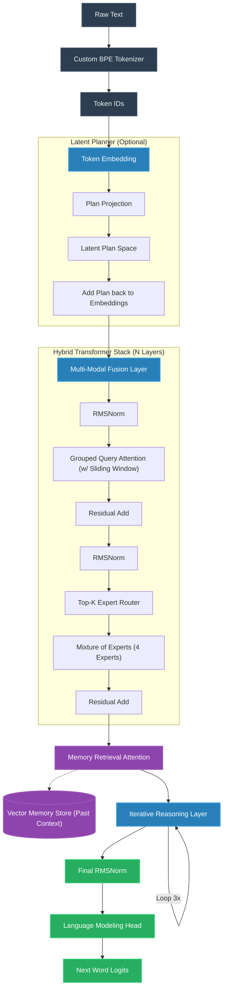

# FantasyLLM User & Configuration Guide

Welcome to the complete guide for configuring and running your custom Large Language Model! This document covers the end-to-end workflow, from placing your dataset to tweaking the advanced neural network features.

---

## 1. Project Workflow (End-to-End)

Follow these steps to train the model from scratch on your own data.

### Step 1: Prepare the Dataset
Your raw text data must be placed in the `data/` directory. 
- The project expects raw text files (e.g., `.txt`).
- **Example:** Place your training text at `data/raw/tinystories_100mb.txt`.

### Step 2: Train the Tokenizer
Before the model can read text, it needs a Tokenizer to convert words into numbers (tokens).
- Run: `python tokenizer/trainer.py`
- This reads your dataset and creates a custom Byte-Pair Encoding (BPE) vocabulary specifically tailored to your text.

### Step 3: Configure the Model and Training
You can adjust how the model learns and behaves using the config files:
- **`config/train_config.py`**: Controls the training loop (Batch Size, Epochs, Learning Rate, etc.).
- **`config/model_config.py`**: Controls the architecture (Number of layers, advanced features, etc.).

### Step 4: Train the Model
- Run: `python train.py`
- The system will automatically detect if you have a GPU. If you don't, it will run on the CPU (which is much slower). It will automatically save the best versions of your model into the `checkpoints/` folder.

### Step 5: Chat & Generate
Once trained, you can interact with your AI!
- Run: `python chat.py --checkpoint checkpoints/best.pt` for an interactive chat.
- Run: `python generate.py --checkpoint checkpoints/best.pt --prompt "Once upon a time"` for a one-off story generation.

---

## 2. System Architecture Graph

This diagram shows exactly how data flows through the advanced components of FantasyLLM during a single forward pass:

---

## 3. Advanced Features & Configuration

Your model is equipped with state-of-the-art AI architectural features. You can enable or disable these at any time by editing the flags in **`config/model_config.py`**.

> **Note:** Enabling these features makes the AI significantly smarter, but requires more compute power and time to train!

### 🧠 Iterative Reasoning (`USE_REASONING = True`)
- **What it does:** Allows the model to loop its internal thoughts back onto itself multiple times (`REASONING_ITERATIONS = 3`) before speaking. 
- **The Use Case:** Crucial for complex logic, math, or maintaining deep story consistency. It stops the AI from blurting out the first word that comes to mind, forcing it to "think before it speaks."

### 🏥 Mixture of Experts (`USE_MOE = True`)
- **What it does:** Replaces the standard dense network with a "Router" and multiple "Experts" (`NUM_EXPERTS = 4`). For every word, the Router chooses the top 2 experts best suited to process that word.
- **The Use Case:** Allows you to drastically increase the model's knowledge capacity (parameter count) without slowing down generation, because only a fraction of the network is used at any given time.

### 📚 Memory-Augmented Attention (`USE_MEMORY = True`)
- **What it does:** Gives the AI an external database (scratchpad) that it can actively query during generation using cross-attention.
- **The Use Case:** Perfect for long-term storytelling. Instead of relying purely on its limited context window, the AI can retrieve facts, character names, or previous events from its memory bank to prevent hallucinations.

### 🗺️ Latent Planner (`USE_PLANNER = True`)
- **What it does:** Projects the initial context into a "plan" vector before running it through the main transformer blocks.
- **The Use Case:** Helps the AI maintain a cohesive narrative arc or structure over long generations, rather than just guessing the next word blindly.

### 🔭 Long Context Extrapolation (`USE_LONG_CONTEXT = True`)
- **What it does:** Uses dynamic NTK-aware Rotary Position Embedding (RoPE) scaling (`LONG_CONTEXT_SCALE = 4.0`).
- **The Use Case:** If you train the model on 128 words, enabling this allows the model to safely read and generate up to 512 words during inference without immediately breaking down and speaking gibberish.

### 🧩 Multi-Modal Fusion (`USE_FUSION = True`)
- **What it does:** Adds a cross-attention layer at the beginning of the model that can accept non-text tensors (like image or audio embeddings).
- **The Use Case:** Prepares the architecture to be upgraded into a Vision-Language Model (VLM) in the future.

---

## 3. Hardware Auto-Tuning

You do not need to configure hardware settings manually; the `trainer.py` script automatically handles it:
1. **Device Detection:** Automatically switches to `cuda` if an NVIDIA GPU is present.
2. **Precision Tuning:** If you have a modern GPU (Ampere/RTX 3000 series or newer), it automatically enables `bfloat16` and `TF32` matrix math for massive speedups.
3. **VRAM Optimization:** If your GPU has less than 8GB of VRAM, the trainer automatically enables **Gradient Accumulation** to prevent "Out of Memory" crashes, allowing you to train on modest hardware!
